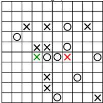
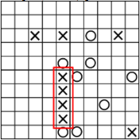

## My X&0 Personalised Game
### Rules
The main goal of this game is to be the first player who makes a combination of 4 of their symbols in a diagonal, horizontal, or vertical row. When a player wins, the other loses the game. A new symbol can be placed on the board, on a cell, only if the number of enemy neighbors is less or equal than the number of the current player neighbors for that cell. In the example below, the green X is a valid way of placing the X symbol, while the red X represents an invalid cell for X to be placed. In this case, the neighbours that are taken into account are the ones in line or in coloumn. 
 
Also, the player has the ability to move a symbol to another cell, if he wants. The symbol can be replaced only to a neighbor cell (including diagonal neighbors). 
For example, a winning configuration for X would be the one showed in the example below: 

 
### Facilities
* The player can choose the size of the grid, by introducing the desired number of lines and columns. The grid would be the size N * M, where N(number of lines) and M(number of columns) would be in the [5,10] interval.
* The player can choose the algorithm that the computer would use in order to generate the possible moves and choose the best one, according to their scores. The options are MINIMAX or ALPHA-BETA algorithms.
* The player can choose the level of difficulty (easy, medium or advanced). Wheter the player has chosen minimax or alpha-beta algorithm, the level of difficuty would be represented by the maximum depth in the algorithm's tree.
* The player can choose what symbol to play with (X or 0). The X always starts first, no matter who is playing the X.
* The game also can be played in an interface implemented with pygame library. 
